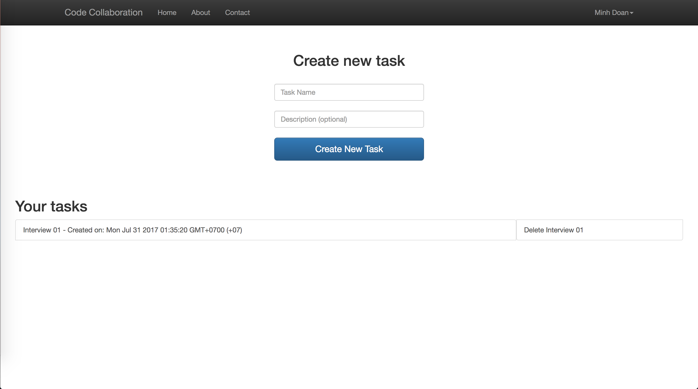
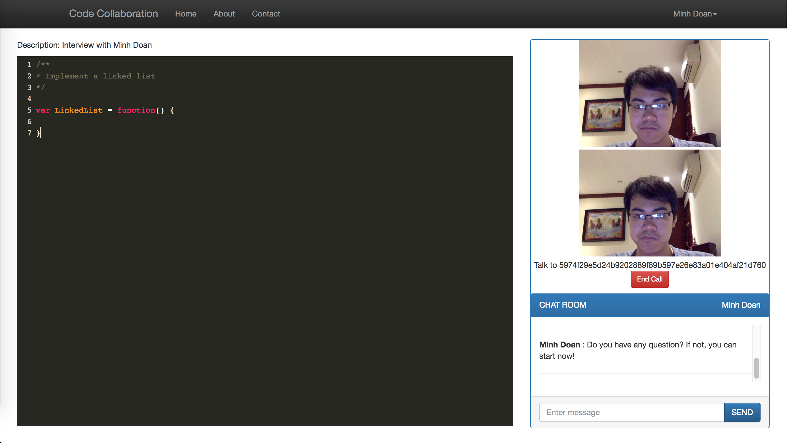

# Code Collaboration

This is simple pair programming platform that is similar to coderpad.io or codeshare.io. This project can be deploy as a platform for online interview. 

This platform now support real-time chatting and video calling so users can easily communicate




# Features:

There are currently some essential featured implemented to this platform.

* Create task and share it with other user
* Collaboratively editing the task
* Video calling and chatting are supported to provide real-time communication (Video calling can only work with two user)
* The content in the editor is automatically saved while user editing
* Display what other users are editing or selecting

# Developing

This project is still simple and mostly work for my education purposes. If you wish to see how it work: 

**Downloading the dependencies**

```
npm install
```

**Running MongoDB**

```
sudo mongod
```

**Configuring the app**

You need to take a look at config/config.js and change the configuration as you wish. Also, you need to register for a PeerJS account, get an API key and use it in public/javascripts/task.js

**Running the server**

After you have done with those set up, it's finally time to run the main app

```
npm start
```

# Library

This project uses some of the essential libraries as follow:

- [Socket.io](https://github.com/socketio/socket.io)
- [Peer.js](https://github.com/peers/peerjs)
- [OT.js](https://github.com/Operational-Transformation/ot.js/)

Please see other dependencies in package.json! 
